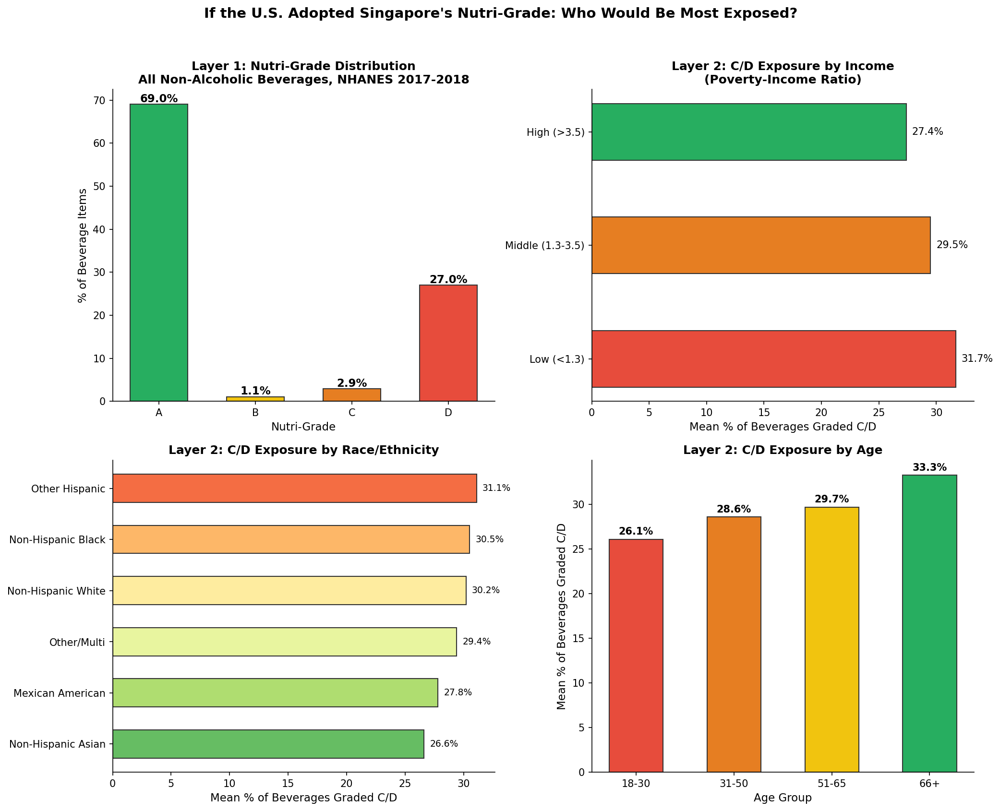

# If the U.S. Adopted Singapore's Nutri-Grade: Who Would Be Most Exposed?
### A Cross-National Policy Simulation Using NHANES 2017–2018



---

## Background

Singapore's **Nutri-Grade** system (mandatory since December 2022) assigns beverages a color-coded grade (A–D) based on sugar and saturated fat content per 100ml. Grade C/D products must display front-of-pack warning labels, and Grade D beverages are banned from advertising.

This project applies Singapore's Nutri-Grade criteria to U.S. dietary intake data to ask: **what would the beverage landscape look like if the U.S. adopted this system — and would exposure to "red-light" beverages differ across socioeconomic and demographic groups?**

---

## Nutri-Grade Criteria (Beverages)

| Grade | Sugar (per 100ml) | Saturated Fat (per 100ml) | Label |
|-------|-------------------|--------------------------|-------|
| **A** (Green) | ≤ 1g | ≤ 0.7g | Optional |
| **B** (Yellow) | ≤ 5g | ≤ 1.2g | Optional |
| **C** (Orange) | ≤ 10g | ≤ 2.8g | **Mandatory** |
| **D** (Red) | > 10g | > 2.8g | **Mandatory + ad ban** |

Overall grade = worst of sugar grade and saturated fat grade.

Source: [Health Promotion Board, Singapore](https://www.hpb.gov.sg/healthy-living/food-and-beverage/nutri-grade/)

---

## Data & Methods

- **Source:** NHANES 2017–2018, Individual Foods file (DR1IFF_J) + Demographics (DEMO_J)
- **Sample:** 21,600 non-alcoholic beverage items from 4,718 U.S. adults (≥18 years)
- **Beverage identification:** USDA food codes 91/93/94/95 million (milk/dairy drinks, carbonated drinks, coffee/tea, other non-alcoholic); alcoholic beverages (92) excluded
- **Nutri-Grade assignment:** Sugar and saturated fat calculated per 100g (≈100ml for beverages), graded using Singapore HPB thresholds
- **Layer 1:** Overall grade distribution across all beverage items
- **Layer 2:** Mean % of C/D-grade beverages per person, stratified by income (PIR), race/ethnicity, age, sex, and education

---

## Key Findings

### Layer 1: Overall Distribution
- **69.0%** of beverage items are Grade A
- **27.0%** are Grade D (red light)
- **~30%** would require mandatory labeling (C+D combined)

### Layer 2: Socioeconomic & Demographic Gradients

| Subgroup | Mean % C/D Beverages |
|----------|---------------------|
| Low income (PIR < 1.3) | **31.7%** |
| High income (PIR > 3.5) | **27.4%** |
| Non-Hispanic Black | **30.5%** |
| Non-Hispanic Asian | **26.6%** |
| Age 66+ | **33.3%** |
| Age 18–30 | **26.1%** |

Low-income, older, and Non-Hispanic Black adults have the highest exposure to C/D-grade beverages — the same groups that carry the greatest NCD burden.

---

## Implications

If Nutri-Grade labeling shifts consumer behavior (as Singapore's data suggests — median sugar level of pre-packaged beverages dropped from 7.1% in 2017 to 4.6% by 2023), the groups with highest C/D exposure stand to benefit most. This positions Nutri-Grade as a potentially equity-enhancing intervention, not just a population-average one.

---

## Limitations

- Single 24-hour dietary recall (measurement error)
- Gram-to-ml approximation (density ≈ 1 for most beverages)
- USDA food codes as beverage classifier (may miss some mixed items)
- No survey weights applied in this version
- Cross-sectional: cannot assess actual behavioral response to labeling

---

## How to Run

```bash
pip install pandas numpy matplotlib
python nutri_grade_nhanes_analysis.py
```

Downloads ~80 MB of NHANES data automatically, runs both layers, saves results figure.

---

## License

Analysis code: MIT License. NHANES data: U.S. CDC public domain. Nutri-Grade criteria: Singapore HPB.
